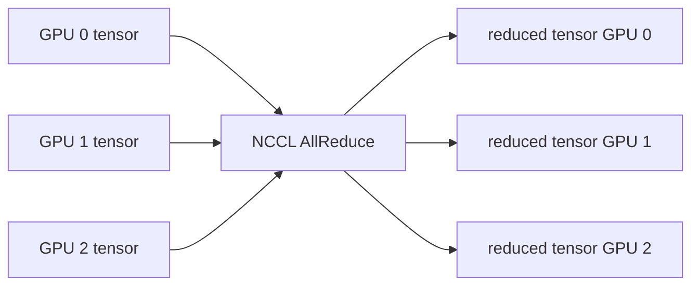

# NCCL Distributed Collectives Lab

A minimal multi-GPU systems project for measuring NCCL AllReduce latency and bandwidth across local GPUs.

## What it demonstrates

- One process per GPU using Python multiprocessing
- NCCL-backed PyTorch distributed process groups
- Warm-up + timed AllReduce iterations
- Correctness checking after collective reduction
- JSON benchmark output for latency and effective algorithmic bandwidth
- Environment-aware launch that works on a single multi-GPU machine

## Run

```bash
python -m pip install -r requirements.txt
python nccl_bench.py --world-size 2 --elements 8388608 --iterations 100
```

The benchmark requires at least `world-size` visible NVIDIA GPUs.

## Data flow



## Output

```json
{
  "world_size": 2,
  "elements": 8388608,
  "mean_ms": "... measured ...",
  "p95_ms": "... measured ...",
  "algorithmic_bandwidth_GBps": "... measured ..."
}
```

The repository intentionally does not publish made-up throughput numbers.

## Resume-safe description

Built a multi-GPU collective benchmark using NCCL/PyTorch Distributed, process-per-GPU launch, synchronization barriers, correctness checks, and repeatable AllReduce latency/bandwidth measurement.

## License

MIT
